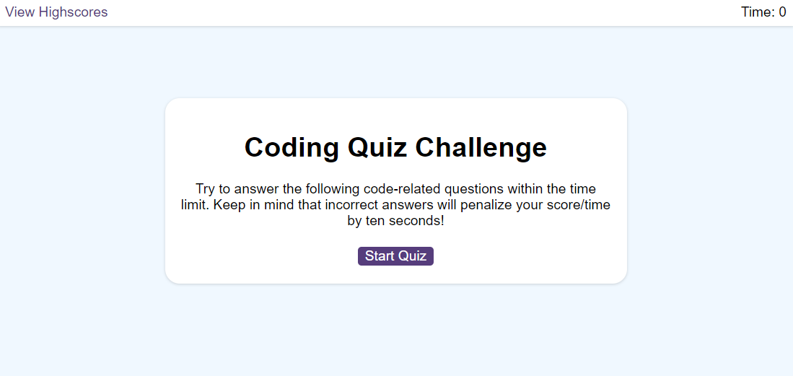
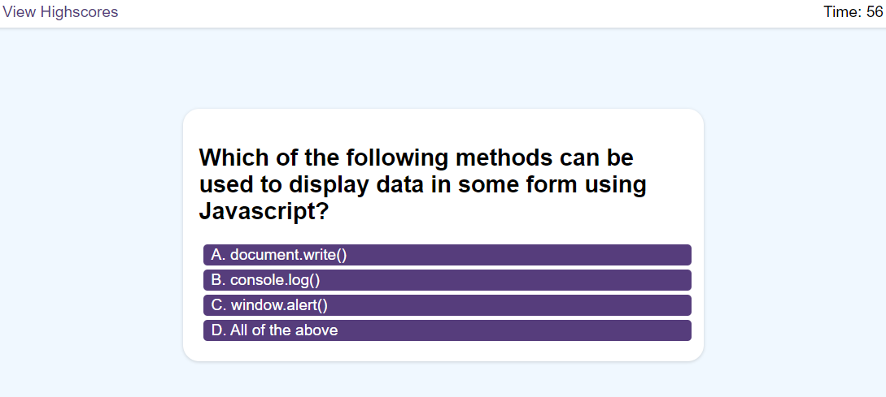
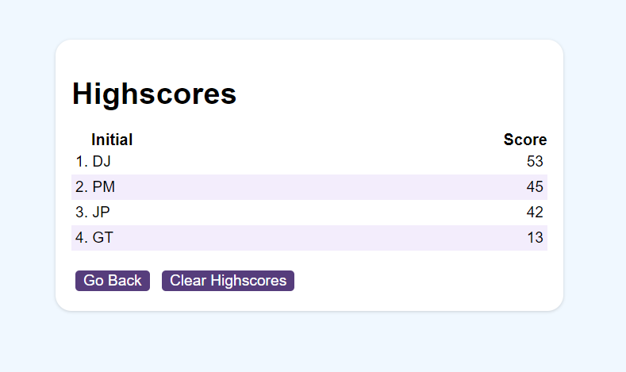

# code-quiz
## Description
multiple-choice coding quiz that can keep track of high scores and quiz-takers' initials.

 - [Link to Live Site](https://creative2012.github.io/code-quiz//)

## Usage

- click start quiz and test your knowledge of the multiple choice questions.
- The quiz ends after all questions have been answered or if the timer runs out.
- Then you can add your initials and save your score.
- click view highscores to vist the highscores page at any time.

The following image shows the web application's main interface:

The following image shows the web application's question interface:

The following image shows the web application's highscore interface:

## Credits

Skills for Life Boot Camp

## License

MIT License

Copyright (c) 2022 creative2012

Permission is hereby granted, free of charge, to any person obtaining a copy
of this software and associated documentation files (the "Software"), to deal
in the Software without restriction, including without limitation the rights
to use, copy, modify, merge, publish, distribute, sublicense, and/or sell
copies of the Software, and to permit persons to whom the Software is
furnished to do so, subject to the following conditions:

The above copyright notice and this permission notice shall be included in all
copies or substantial portions of the Software.

THE SOFTWARE IS PROVIDED "AS IS", WITHOUT WARRANTY OF ANY KIND, EXPRESS OR
IMPLIED, INCLUDING BUT NOT LIMITED TO THE WARRANTIES OF MERCHANTABILITY,
FITNESS FOR A PARTICULAR PURPOSE AND NONINFRINGEMENT. IN NO EVENT SHALL THE
AUTHORS OR COPYRIGHT HOLDERS BE LIABLE FOR ANY CLAIM, DAMAGES OR OTHER
LIABILITY, WHETHER IN AN ACTION OF CONTRACT, TORT OR OTHERWISE, ARISING FROM,
OUT OF OR IN CONNECTION WITH THE SOFTWARE OR THE USE OR OTHER DEALINGS IN THE
SOFTWARE.
